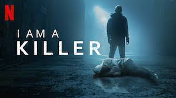
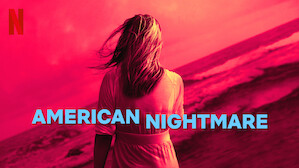

# NetFlix_Clone
## Date: 10.07.25
## Objective:
To create a modern, responsive navigation bar using CSS Flexbox, mimicking real-world websites like Netflix. This helps reinforce alignment, spacing, and layout structuring using Flexbox properties.

## Tasks:

#### 1. Structure the HTML Layout:
Use a ```<nav>``` tag as the main container.

Add a brand logo/title on the left using a ```<div> or <h1>```.

Add navigation links like Home, Menu, About, Contact, and Login using a ```<ul> with <li> and <a>```.

#### 2. Apply Flexbox for Layout:
Use display: flex on the ```<nav>``` container.

Use justify-content: space-between to align the logo and menu.

Use align-items: center to vertically center both sections.

Style list items with horizontal spacing using gap or margin.

#### 3. Style Like a Real-World Navbar:
Add background color (e.g., dark or gradient like Netflix/Zomato).

Style text with bold fonts, hover effects, and link styling.

Remove default ul and li styles (list-style: none, text-decoration: none).

#### 4. Bonus Enhancements:
Add a hover underline or button effect on links.

Make it responsive using flex-wrap or media queries.

Fix the nav bar to top with position: sticky.
## HTML Code:
```
<!DOCTYPE html>
<html lang="en">
<head>
    <meta charset="UTF-8">
    <meta name="viewport" content="width=device-width, initial-scale=1.0">
    <title>Netflix webpage clone</title>
    <link href="style.css" rel="stylesheet">
</head>
<body>
    <div class="container">
        <header class="header">
            <div class="logo">NETFLIX</div>
            <div class="date">Friday Feb 19</div>
            <nav>
            <a href="#">Home</a>
            <a href="#">Movies</a>
            <a href="#">TV Shows</a>
            <a href="#">My List</a>
            </nav>
            <div class="profile">
            
            <span class="dropdown">&#9662;</span>
            </div>
        </header>

        <div class="main-content">
            <div class="left">
                <p class="tags">FICTION | TV SHOW | KNOWLEDGE</p>
                <h1 class="main-title">IRON MAN</h1>
                <p class="meta">2008 | DIRECTOR : MARVEL CORP | SEASON 1 (1 Episodes)</p>
                <p class="desc">
                Ready to marvel at the Marvel Cinematic Universe? The comic book leaders deliver superhero movies and shows like no other. Put on your cape and join in the action.
                </p>
                <div class="buttons">
                <button class="stream-btn">STREAM NOW ></button>
                <button class="all-episodes">ALL EPISODES</button>
                </div>
            </div>

            <div class="right">
                <div class="watch-trailer">
                <div class="play-icon">&#9658;</div>
                <p>Watch Trailer</p>
                </div>
            </div>
            </div>

            <div class="popular">
            <h3>POPULAR SHOWS THIS WEEK</h3>
            <div class="show-list">
                <div class="show-card"><p>I Am Killer</p></div>
                <div class="show-card"><p>Predator</p></div>
                <div class="show-card"><p>Nightmare</p></div>
                <div class="show-card"><p>Innocence Files</p></div>
            </div>
            </div>

        </main>
    </div>
</body>
</html>
```
## CSS Code:
```
body {
  background-color: rgb(221, 39, 39);
  color: white;
  margin: 0;
  font-family: Arial, sans-serif;
}

.container {
  width: 90%;
  max-width: 1000px;
  background-color: #000000;
  border-radius: 4px;
  padding: 20px 200px;
  box-shadow: 0 0 30px 20px rgba(0, 0, 0, 0.27);
  margin: 5% auto;
}

.header {
  display: flex;
  justify-content: space-between;
  align-items: center;
  background: #111;
  padding: 15px 20px;
  border-radius: 4px;
}

.logo {
  font-size: 24px;
  font-weight: bold;
  color: white;
}

.date {
  color: gray;
  margin-left: 20px;
}

nav a {
  margin: 0 10px;
  color: white;
  text-decoration: none;
  font-weight: 500;
}

.profile {
  display: flex;
  align-items: center;
}

.profile img {
  border-radius: 50%;
  width: 30px;
  height: 30px;
}

.dropdown {
  color: white;
  margin-left: 5px;
}

.main-content {
  display: flex;
  justify-content: space-between;
  padding: 50px 60px;
  background: #000;
  color: white;
}

.left {
  width: 55%;
}

.tags {
  color: #ccc;
  font-size: 14px;
  margin-bottom: 10px;
}

.main-title {
  font-size: 64px;
  margin: 10px 0;
}

.meta {
  color: #bbb;
  font-size: 16px;
  margin: 10px 0;
}

.desc {
  color: #aaa;
  font-size: 15px;
  margin: 20px 0;
  line-height: 1.5;
}

.buttons {
  margin-top: 20px;
}

.stream-btn {
  background-color: red;
  color: white;
  padding: 10px 20px;
  font-weight: bold;
  border: none;
  margin-right: 10px;
  cursor: pointer;
}

.all-episodes {
  background: black;
  color: white;
  padding: 10px 20px;
  border: 1px solid white;
  font-weight: bold;
  cursor: pointer;
}

.right {
  width: 40%;
  position: relative;
  text-align: center;
}

.watch-trailer {
  position: absolute;
  top: 40%;
  left: 50%;
  transform: translate(-50%, -50%);
  text-align: center;
}

.play-icon {
  font-size: 50px;
  width: 70px;
  height: 70px;
  border-radius: 50%;
  border: 3px solid white;
  display: flex;
  align-items: center;
  justify-content: center;
  margin: auto;
}

.watch-trailer p {
  margin-top: 10px;
}

.popular {
  background: #000;
  color: white;
  padding: 30px 60px;
}

.popular h3 {
  font-size: 20px;
  margin-bottom: 15px;
}

.show-list {
  display: flex;
  gap: 20px;
}

.show-card img {
  width: 120px;
  height: 80px;
  object-fit: cover;
}

.show-card p {
  text-align: center;
  margin-top: 5px;
}
```
## Output:


## Result:
A modern, responsive navigation bar using CSS Flexbox, mimicking real-world websites like Netflix. This helps reinforce alignment, spacing, and layout structuring using Flexbox properties is created successfully.
